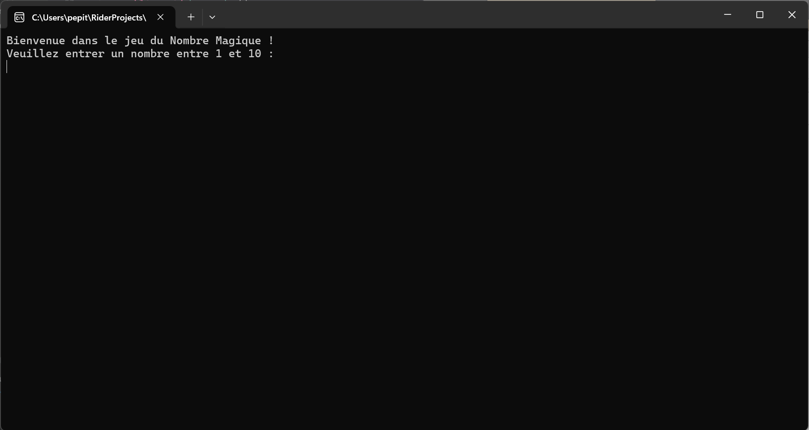
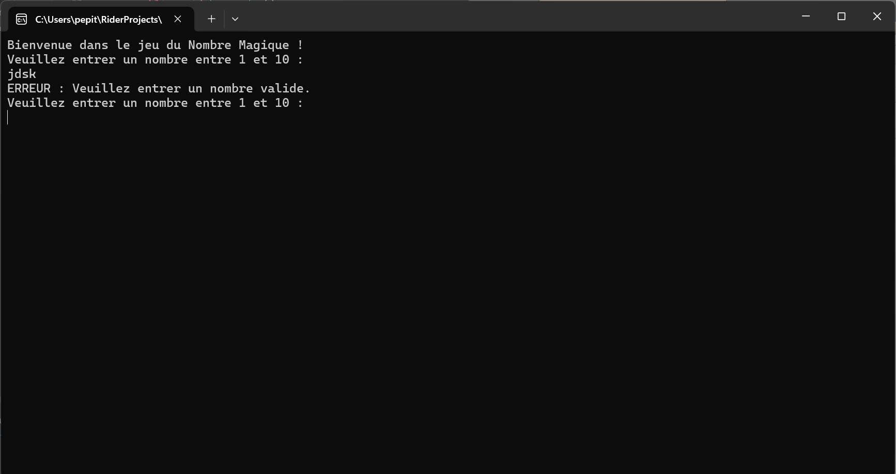
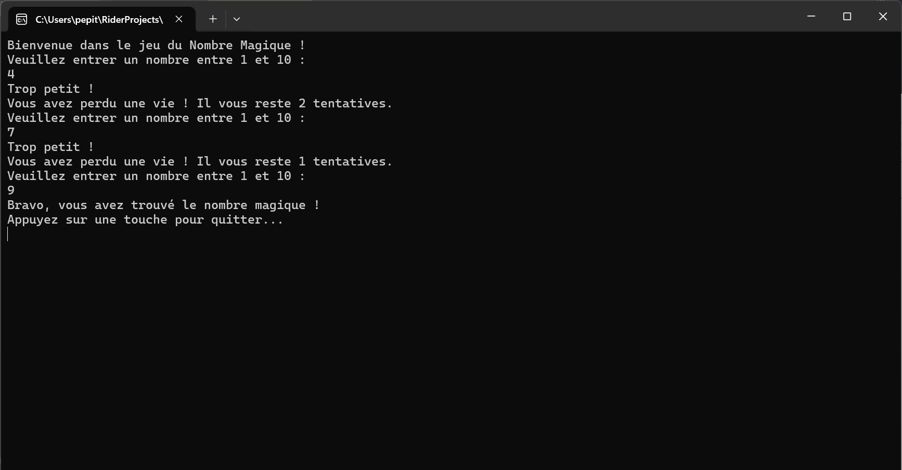

# Nombre Magique 🎲

## Description
Le **Nombre Magique** est un jeu console développé en C#. L'utilisateur doit deviner un nombre aléatoire entre 1 et 10.
Le programme fournit des indications pour guider le joueur ("Trop petit" ou "Trop grand") et suit le nombre de tentatives restantes.
Le joueur gagne s’il trouve le nombre dans la limite des tentatives disponibles. Sinon, il perd.

---

## Fonctionnalités
- **Génération aléatoire d'un nombre magique :** Entre une plage définie (par défaut 1 à 10).
- **Validation des entrées utilisateur :** Messages clairs en cas d’erreur ou d’entrée non valide.
- **Système de vies :** Le joueur dispose de 3 tentatives pour deviner le bon nombre.
- **Indications dynamiques :**
    - "Trop petit"
    - "Trop grand"
- **Affichage des résultats :**
    - Message de victoire si le joueur trouve le nombre.
    - Message de défaite avec révélation du nombre magique.

---

## Aperçu

Voici un aperçu du jeu **Nombre Magique** en action :

### 1. Début du jeu
Au lancement, le jeu demande au joueur de deviner un nombre dans une plage définie :


### 2. En cas d'erreur
Si l'utilisateur entre une valeur invalide, un message d'erreur s'affiche :


### 3. Victoire
Quand le joueur trouve le bon nombre, un message de victoire est affiché :


---

## Technologies utilisées
- **Langage :** C#
- **Environnement :** Application console
- **Outils :** JetBrains Rider (mais le projet peut aussi être ouvert dans Visual Studio)

YouShallNotBug

## Instructions pour exécuter le projet
1. Clonez ce dépôt sur votre machine :
   ```bash
   git clone https://github.com/youShallNotBug/nombre_magique.git

